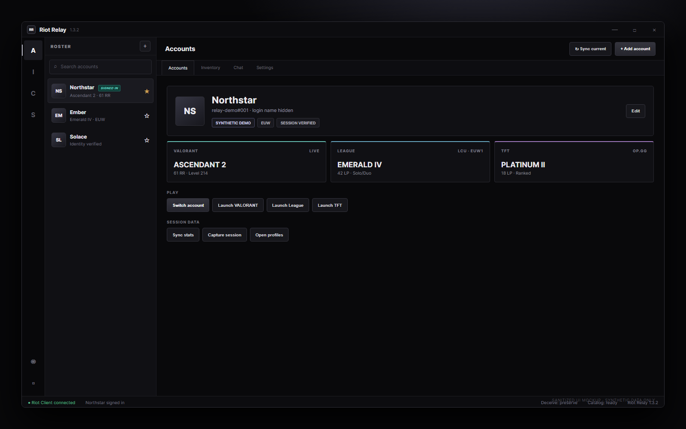
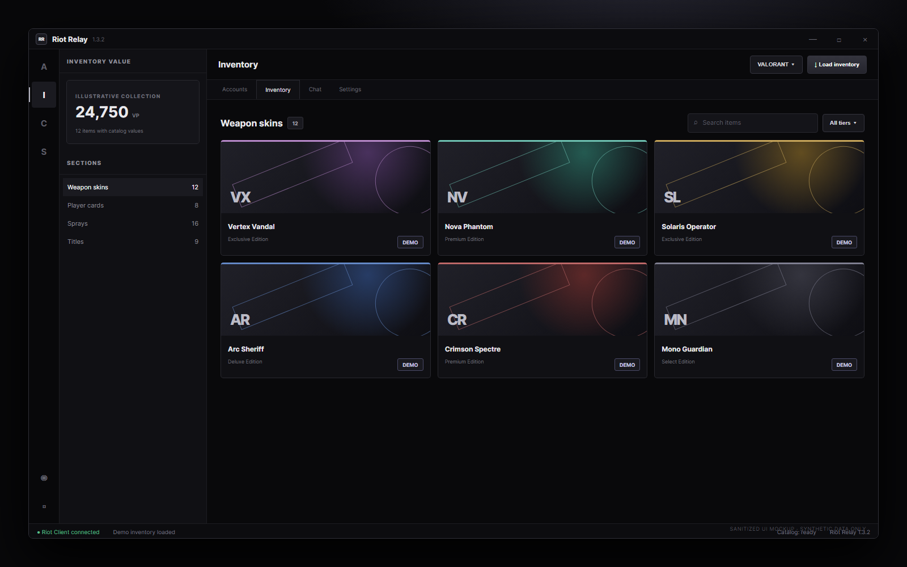
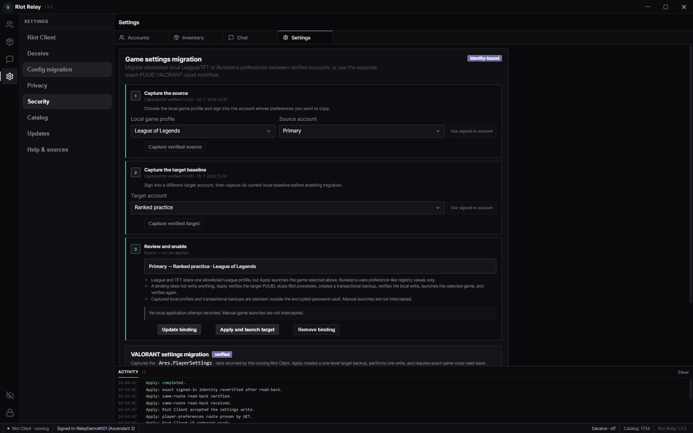
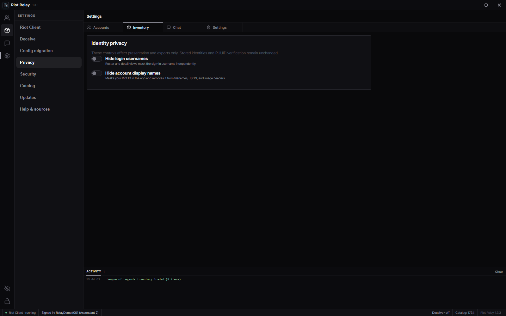
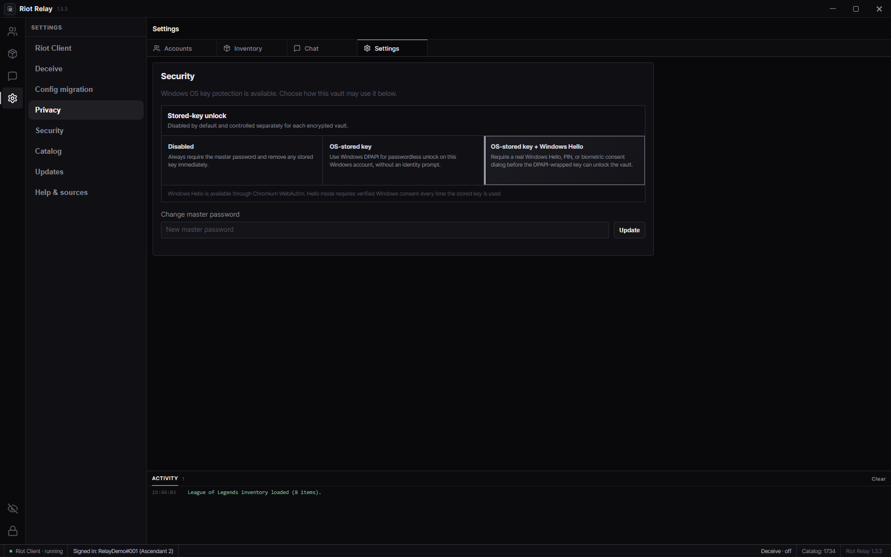

# Riot Relay

Riot Relay is a Windows account command center for Riot games: encrypted credentials, PUUID-bound sessions, deliberate switching, unified stats and inventories, current-session chat, privacy controls, and verified VALORANT settings migration.

**Version 1.3.3** · [Documentation](https://jirkaachs.github.io/Riot-Relay/) · [Latest release](https://github.com/JirkaachS/Riot-Relay/releases/latest) · [Release notes](.github/release-notes/v1.3.3.md) · [Security](https://jirkaachs.github.io/Riot-Relay/security.html) · [Privacy](https://jirkaachs.github.io/Riot-Relay/privacy.html)

## Interface

These screenshots are generated from Riot Relay’s actual renderer with a capture-only synthetic API fixture. No real Riot identifiers, credentials, sessions, messages, settings, inventory, logs, or user files are read or shown.

[](docs/assets/screenshots/accounts-overview.png)

[](docs/assets/screenshots/inventory-workspace.png)

[](docs/assets/screenshots/settings-migration.png)

<p align="center"><a href="docs/assets/screenshots/privacy-settings.png"></a> <a href="docs/assets/screenshots/security-settings.png"></a></p>

## Core capabilities

- Encrypted local credential vault with optional Windows-protected unlock modes.
- Exact-PUUID session verification before switch success is reported.
- VALORANT, League, and TFT rank synchronization; inventory, wallet, export, chat, profile, and privacy tools.
- Optional Discord Rich Presence with independent disclosure controls.
- Built-in presence proxy informed by [Deceive](https://github.com/molenzwiebel/Deceive), including a League-only helper that is never exposed to VALORANT.
- Default switching does not launch a game; game launch is always explicit.
- Riot OTP and 2FA challenges remain manual in the official Riot Client.

## VALORANT settings migration

Riot Relay can Capture the `Ares.PlayerSettings` data document returned by the running Riot Client, Apply it to a different signed-in account, and Restore the target’s latest pre-Apply backup.

Safety properties:

1. PUUID is checked before and after source reads and around target writes.
2. Apply refuses to write unless the target’s current settings were read and durably backed up.
3. A write uses one proven player-preferences route and exactly one PUT.
4. The same route is read back and must structurally match the intended `data` document.
5. Each Apply replaces the prior backup, providing one-level Restore for that target.
6. Existing wrapper-format captures/backups are normalized for compatibility.

Riot’s local player-preferences endpoint is undocumented and may change. Immediate read-back does not guarantee how a later VALORANT build will interpret every field. Restart VALORANT after Apply or Restore. Automated validation never performs a live settings PUT.

Captured settings and backups are local plaintext JSON outside the encrypted password vault. Privacy-filtered operation stages are shown in Activity and appended to `config-operations.log`; UI Clear affects only the current in-memory Activity list.


## What it protects

- Passwords are stored in a local AES-256-GCM vault protected by a master-password-derived key.
- Login username, Riot ID, and PUUID remain separate; PUUID is authoritative.
- A mismatched active identity is rejected rather than silently attached to another roster entry.
- Renderer isolation uses `contextIsolation: true` and `nodeIntegration: false`; local API credentials and authorization headers stay in the main process.

Encryption at rest does not protect an unlocked vault, plaintext settings capture, operation log, or active Riot session from malware or someone controlling the same Windows account. Keep Riot multi-factor authentication enabled and use a unique master password; there is no hosted recovery service.

## Install

Open the [latest GitHub Release](https://github.com/JirkaachS/Riot-Relay/releases/latest), expand **Assets**, and download a Windows x64 installer rather than a source archive:

- **EXE / NSIS (recommended):** normal installation and automatic application updates.
- **MSI:** administrator-managed deployment or manual updates.

Riot Relay does **not** claim code signing. Windows SmartScreen may show an unsigned/unrecognized-app warning. Download only from `JirkaachS/Riot-Relay`, verify `SHA256SUMS.txt`, inspect the tag/source, and proceed only if you trust the build.

## Development and release builds

```powershell
npm ci
npm test
npm start
```

Tagged releases test the project, build x64 NSIS and MSI artifacts, generate SHA-256 checksums, and publish reviewed release notes through GitHub Actions. The workflow verifies that the pushed tag matches `package.json`.

## Network and privacy

Requested Riot features communicate with the local Riot Client and Riot-operated services. Selected catalog, rank, and profile views may contact identified third-party services. EXE builds may contact GitHub Releases for updates. See the [privacy disclosure](https://jirkaachs.github.io/Riot-Relay/privacy.html) for stored data, network behavior, and deletion guidance.

## Support and responsible reporting

Start with the [troubleshooting guide](https://jirkaachs.github.io/Riot-Relay/troubleshooting.html). Use GitHub private vulnerability reporting when available; otherwise request a private maintainer contact in a minimal issue. Never post credentials, authorization headers, vault/session/settings files, raw operation logs, or real account identifiers.

## Project status and attribution

Riot Relay is unofficial community software and is not endorsed by Riot Games. Riot Games and associated properties are trademarks or registered trademarks of Riot Games, Inc.

The built-in presence proxy is informed by [Deceive by molenzwiebel](https://github.com/molenzwiebel/Deceive). OP.GG protocol research was informed by [OPGG.py](https://github.com/ShoobyDoo/OPGG.py); its source and Python runtime are not bundled. See [THIRD_PARTY_NOTICES.md](THIRD_PARTY_NOTICES.md) for complete attribution.

Licensed under the [MIT License](LICENSE)
